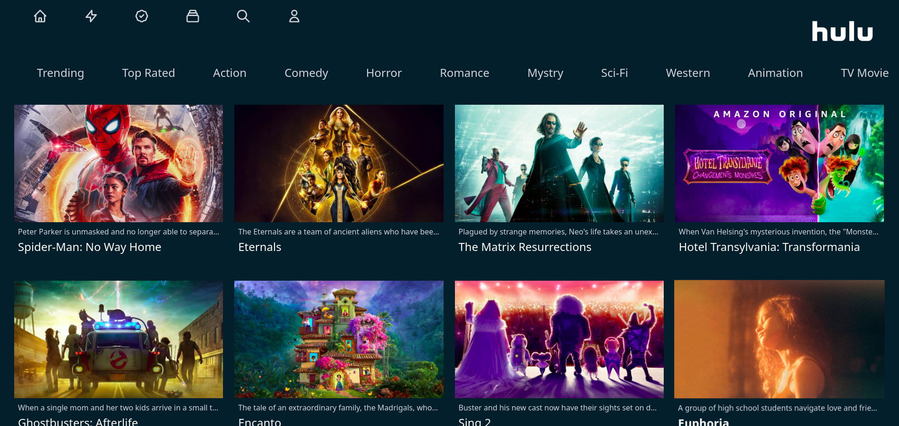

You can check out Hulu Clone Deployment [Here](https://hulu-clone-nextjs-psi.vercel.app/) - your feedback and contributions are welcome!

## Technology Stack

- [Next.js](https://nextjs.org) - Server-Side rendred and SEO frendly built.
- [Tailwind Css](https://tailwindcss.com/) - Tailwind CSS is a utility-first CSS framework for rapidly building custom user interfaces.

## Getting Started

First, run the development server:

```bash
npm run dev
# or
yarn dev
```

Open [http://localhost:3000](http://localhost:3000) with your browser to see the result.

## Images


.
